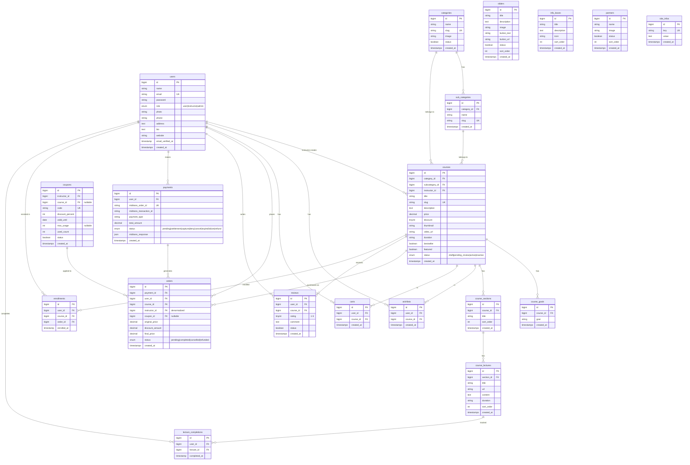

# 🗄️ BelajarKUY — Database Schema (Optimized v2)

> Detail lengkap semua tabel, kolom, relasi, dan constraint database.
> Referensi: YouTubeLMS (Laravel 11) + enhancement untuk BelajarKUY.
> **Version:** 2.0 | **Optimized:** 12 Mei 2026

---

## Prinsip Desain

1. **Normalisasi 3NF** — kecuali denormalisasi strategis yang didokumentasikan
2. **Index pada kolom yang sering di-query** — FK, slug, status, lookup columns
3. **Hapus redundansi berbahaya** — data derivable yang bisa stale tidak disimpan
4. **Denormalisasi hanya untuk performa** — `instructor_id` di `orders` (reporting), `price` di `orders` (snapshot)

---

## Perubahan dari v1

| # | Perubahan | Alasan |
|---|-----------|--------|
| 1 | ❌ Hapus tabel `midtrans_configs` | API keys harus di `.env`, bukan database (security) |
| 2 | ❌ Hapus `instructor_id` & `price` dari `carts` | Derivable dari `courses`, bisa stale jika harga berubah |
| 3 | ✅ Tambah UNIQUE `(user_id, course_id)` di `carts` | Mencegah duplikat kursus di cart |
| 4 | ✅ Tambah `coupon_id` & `discount_amount` di `orders` | Track kupon yang dipakai saat checkout |
| 5 | ✅ Tambah tabel `enrollments` | Akses cepat: "kursus apa saja yang sudah di-enroll?" tanpa join ke payments+orders |
| 6 | ✅ Tambah tabel `lecture_completions` | Track progress belajar student per lecture |
| 7 | ✅ Tambah composite index pada tabel-tabel pivot | Query cepat untuk lookup relasi |
| 8 | ✅ Tambah `coupon_id` nullable FK di `coupons` ke `courses` | Kupon bisa spesifik per kursus (opsional, nullable = berlaku global) |

---

## ERD Overview (Mermaid)



---

## Detail Tabel

### 1. `users`

| Column | Type | Constraint | Index | Description |
|--------|------|-----------|-------|-------------|
| id | bigint | PK, AI | ✅ | Primary key |
| name | varchar(255) | NOT NULL | | Nama lengkap |
| email | varchar(255) | UNIQUE, NOT NULL | ✅ | Email login |
| email_verified_at | timestamp | NULLABLE | | Verifikasi email |
| password | varchar(255) | NOT NULL | | Hashed password |
| role | enum('user','instructor','admin') | DEFAULT 'user' | ✅ | Role user |
| photo | varchar(255) | NULLABLE | | Path foto profil |
| phone | varchar(20) | NULLABLE | | Nomor telepon |
| address | text | NULLABLE | | Alamat |
| bio | text | NULLABLE | | Bio (untuk instructor) |
| website | varchar(255) | NULLABLE | | Website (untuk instructor) |
| remember_token | varchar(100) | NULLABLE | | Remember me token |
| created_at | timestamp | | | |
| updated_at | timestamp | | | |

> **Index:** `role` — sering dipakai untuk filter/scope user berdasarkan role.

### 2. `categories`

| Column | Type | Constraint | Index | Description |
|--------|------|-----------|-------|-------------|
| id | bigint | PK, AI | ✅ | |
| name | varchar(255) | NOT NULL | | Nama kategori |
| slug | varchar(255) | UNIQUE | ✅ | URL-friendly name |
| image | varchar(255) | NULLABLE | | Icon/image kategori |
| status | boolean | DEFAULT true | ✅ | Aktif/nonaktif |
| created_at | timestamp | | | |
| updated_at | timestamp | | | |

### 3. `sub_categories`

| Column | Type | Constraint | Index | Description |
|--------|------|-----------|-------|-------------|
| id | bigint | PK, AI | ✅ | |
| category_id | bigint | FK → categories.id, CASCADE | ✅ | Parent category |
| name | varchar(255) | NOT NULL | | |
| slug | varchar(255) | UNIQUE | ✅ | |
| created_at | timestamp | | | |
| updated_at | timestamp | | | |

### 4. `courses`

| Column | Type | Constraint | Index | Description |
|--------|------|-----------|-------|-------------|
| id | bigint | PK, AI | ✅ | |
| category_id | bigint | FK → categories.id, CASCADE | ✅ | |
| subcategory_id | bigint | FK → sub_categories.id, SET NULL | ✅ | |
| instructor_id | bigint | FK → users.id, CASCADE | ✅ | Pembuat kursus |
| title | varchar(255) | NOT NULL | | Judul kursus |
| slug | varchar(255) | UNIQUE | ✅ | |
| description | text | NULLABLE | | Deskripsi lengkap |
| price | decimal(12,2) | DEFAULT 0 | | Harga dalam Rupiah |
| discount | tinyint unsigned | DEFAULT 0 | | Persentase diskon (0-100) |
| thumbnail | varchar(255) | NULLABLE | | Gambar thumbnail |
| video_url | varchar(255) | NULLABLE | | Preview video URL |
| duration | varchar(50) | NULLABLE | | Total durasi kursus |
| bestseller | boolean | DEFAULT false | ✅ | |
| featured | boolean | DEFAULT false | ✅ | |
| status | enum('draft','pending_review','active','inactive') | DEFAULT 'draft' | ✅ | |
| created_at | timestamp | | | |
| updated_at | timestamp | | | |

> **Composite Index:** `(status, featured)` dan `(status, bestseller)` — dipakai di landing page query.

### 5. `course_goals`

| Column | Type | Constraint | Index |
|--------|------|-----------|-------|
| id | bigint | PK, AI | ✅ |
| course_id | bigint | FK → courses.id, CASCADE | ✅ |
| goal | varchar(255) | NOT NULL | |
| created_at | timestamp | | |
| updated_at | timestamp | | |

### 6. `course_sections`

| Column | Type | Constraint | Index |
|--------|------|-----------|-------|
| id | bigint | PK, AI | ✅ |
| course_id | bigint | FK → courses.id, CASCADE | ✅ |
| title | varchar(255) | NOT NULL | |
| sort_order | int unsigned | DEFAULT 0 | |
| created_at | timestamp | | |
| updated_at | timestamp | | |

### 7. `course_lectures`

| Column | Type | Constraint | Index |
|--------|------|-----------|-------|
| id | bigint | PK, AI | ✅ |
| section_id | bigint | FK → course_sections.id, CASCADE | ✅ |
| title | varchar(255) | NOT NULL | |
| url | varchar(500) | NULLABLE | |
| content | text | NULLABLE | |
| duration | varchar(50) | NULLABLE | |
| sort_order | int unsigned | DEFAULT 0 | |
| created_at | timestamp | | |
| updated_at | timestamp | | |

### 8. `wishlists`

| Column | Type | Constraint | Index |
|--------|------|-----------|-------|
| id | bigint | PK, AI | ✅ |
| user_id | bigint | FK → users.id, CASCADE | ✅ |
| course_id | bigint | FK → courses.id, CASCADE | ✅ |
| created_at | timestamp | | |
| updated_at | timestamp | | |

> **UNIQUE constraint:** `(user_id, course_id)` — 1 user hanya bisa wishlist 1 kursus sekali.

### 9. `carts` (Simplified)

| Column | Type | Constraint | Index |
|--------|------|-----------|-------|
| id | bigint | PK, AI | ✅ |
| user_id | bigint | FK → users.id, CASCADE | ✅ |
| course_id | bigint | FK → courses.id, CASCADE | ✅ |
| created_at | timestamp | | |
| updated_at | timestamp | | |

> **UNIQUE constraint:** `(user_id, course_id)` — mencegah duplikat di cart.
>
> ⚠️ **Tidak menyimpan `price`** — harga dihitung real-time dari `courses.price` dan `courses.discount`. Ini mencegah harga basi di cart.
>
> ⚠️ **Tidak menyimpan `instructor_id`** — derivable via `course.instructor_id`. Mengurangi redundansi.

### 10. `coupons` (Enhanced)

| Column | Type | Constraint | Index | Description |
|--------|------|-----------|-------|-------------|
| id | bigint | PK, AI | ✅ | |
| instructor_id | bigint | FK → users.id, CASCADE | ✅ | Pembuat kupon |
| course_id | bigint | FK → courses.id, SET NULL, NULLABLE | ✅ | NULL = berlaku untuk semua kursus instructor |
| code | varchar(50) | UNIQUE | ✅ | Kode kupon (rename dari `name`) |
| discount_percent | int unsigned | NOT NULL | | Persentase diskon (1-100) |
| valid_until | date | NOT NULL | | Tanggal kadaluarsa |
| max_usage | int unsigned | NULLABLE | | NULL = unlimited usage |
| used_count | int unsigned | DEFAULT 0 | | Counter pemakaian |
| status | boolean | DEFAULT true | ✅ | Aktif/nonaktif |
| created_at | timestamp | | | |
| updated_at | timestamp | | | |

> **Enhancement dari v1:** Menambah `course_id` (kupon spesifik), `max_usage`/`used_count` (batas pemakaian), rename `name` → `code` agar lebih jelas.

### 11. `payments`

| Column | Type | Constraint | Index | Description |
|--------|------|-----------|-------|-------------|
| id | bigint | PK, AI | ✅ | |
| user_id | bigint | FK → users.id, CASCADE | ✅ | |
| midtrans_order_id | varchar(100) | UNIQUE | ✅ | Format: BKUY-{timestamp} |
| midtrans_transaction_id | varchar(100) | NULLABLE | ✅ | Dari callback Midtrans |
| payment_type | varchar(50) | NULLABLE | | credit_card, gopay, bank_transfer, etc |
| total_amount | decimal(12,2) | NOT NULL | | Total pembayaran |
| status | enum('pending','settlement','capture','deny','cancel','expire','failure','refund') | DEFAULT 'pending' | ✅ | |
| midtrans_response | json | NULLABLE | | Full response dari Midtrans |
| created_at | timestamp | | | |
| updated_at | timestamp | | | |

> **Index:** `(user_id, status)` — untuk query "pembayaran pending milik user X".

### 12. `orders` (Enhanced)

| Column | Type | Constraint | Index | Description |
|--------|------|-----------|-------|-------------|
| id | bigint | PK, AI | ✅ | |
| payment_id | bigint | FK → payments.id, CASCADE | ✅ | |
| user_id | bigint | FK → users.id, CASCADE | ✅ | |
| course_id | bigint | FK → courses.id, CASCADE | ✅ | |
| instructor_id | bigint | FK → users.id, CASCADE | ✅ | **Denormalized** — snapshot untuk reporting cepat |
| coupon_id | bigint | FK → coupons.id, SET NULL, NULLABLE | ✅ | Kupon yang dipakai |
| original_price | decimal(12,2) | NOT NULL | | Harga asli saat checkout |
| discount_amount | decimal(12,2) | DEFAULT 0 | | Potongan harga (dari kupon) |
| final_price | decimal(12,2) | NOT NULL | | Harga final = original - discount |
| status | enum('pending','completed','cancelled','refunded') | DEFAULT 'pending' | ✅ | |
| created_at | timestamp | | | |
| updated_at | timestamp | | | |

> **Denormalisasi `instructor_id`:** Disimpan sebagai snapshot karena sering diquery untuk laporan pendapatan instructor. Join ke `courses` setiap kali terlalu mahal.
>
> **Pricing snapshot:** `original_price`, `discount_amount`, `final_price` disimpan sebagai record historis. Harga kursus bisa berubah, tapi order harus mencatat harga saat transaksi.

### 13. `enrollments` ✨ NEW

| Column | Type | Constraint | Index | Description |
|--------|------|-----------|-------|-------------|
| id | bigint | PK, AI | ✅ | |
| user_id | bigint | FK → users.id, CASCADE | ✅ | |
| course_id | bigint | FK → courses.id, CASCADE | ✅ | |
| order_id | bigint | FK → orders.id, CASCADE | ✅ | Referensi ke order |
| enrolled_at | timestamp | NOT NULL | | Waktu enrollment |

> **UNIQUE constraint:** `(user_id, course_id)` — 1 user hanya bisa enroll 1 kursus sekali.
>
> **Kenapa tabel ini penting?** Query "tampilkan kursus yang sudah di-enroll user" menjadi 1 query sederhana, tanpa perlu join `orders` → `payments` → cek status.

### 14. `lecture_completions` ✨ NEW

| Column | Type | Constraint | Index | Description |
|--------|------|-----------|-------|-------------|
| id | bigint | PK, AI | ✅ | |
| user_id | bigint | FK → users.id, CASCADE | ✅ | |
| lecture_id | bigint | FK → course_lectures.id, CASCADE | ✅ | |
| completed_at | timestamp | NOT NULL | | Waktu menyelesaikan lecture |

> **UNIQUE constraint:** `(user_id, lecture_id)` — 1 user hanya bisa complete 1 lecture sekali.
>
> **Use case:** Hitung progress kursus = `lecture_completions WHERE user_id = X` / total lectures di kursus.

### 15. `reviews`

| Column | Type | Constraint | Index |
|--------|------|-----------|-------|
| id | bigint | PK, AI | ✅ |
| user_id | bigint | FK → users.id, CASCADE | ✅ |
| course_id | bigint | FK → courses.id, CASCADE | ✅ |
| rating | tinyint unsigned | NOT NULL (1-5) | |
| comment | text | NULLABLE | |
| status | boolean | DEFAULT true | ✅ |
| created_at | timestamp | | |
| updated_at | timestamp | | |

> **UNIQUE constraint:** `(user_id, course_id)` — 1 user hanya bisa review 1 kursus sekali.

### 16. `sliders`

| Column | Type | Constraint |
|--------|------|-----------|
| id | bigint | PK, AI |
| title | varchar(255) | NULLABLE |
| description | text | NULLABLE |
| image | varchar(255) | NOT NULL |
| button_text | varchar(100) | NULLABLE |
| button_url | varchar(500) | NULLABLE |
| status | boolean | DEFAULT true |
| sort_order | int unsigned | DEFAULT 0 |
| created_at | timestamp | |
| updated_at | timestamp | |

### 17. `info_boxes`

| Column | Type | Constraint |
|--------|------|-----------|
| id | bigint | PK, AI |
| title | varchar(255) | NOT NULL |
| description | text | NULLABLE |
| icon | varchar(100) | NULLABLE |
| sort_order | int unsigned | DEFAULT 0 |
| created_at | timestamp | |
| updated_at | timestamp | |

### 18. `partners`

| Column | Type | Constraint |
|--------|------|-----------|
| id | bigint | PK, AI |
| name | varchar(255) | NOT NULL |
| image | varchar(255) | NOT NULL |
| status | boolean | DEFAULT true |
| sort_order | int unsigned | DEFAULT 0 |
| created_at | timestamp | |
| updated_at | timestamp | |

### 19. `site_infos`

| Column | Type | Constraint |
|--------|------|-----------|
| id | bigint | PK, AI |
| key | varchar(100) | UNIQUE |
| value | text | NULLABLE |
| created_at | timestamp | |
| updated_at | timestamp | |

---

## Index Strategy

### Composite Indexes (untuk performa)

```
courses:       (status, featured)          — Landing page: featured courses
courses:       (status, bestseller)        — Landing page: bestseller courses
courses:       (instructor_id, status)     — Instructor dashboard
orders:        (user_id, status)           — Student order history
orders:        (instructor_id, status)     — Instructor revenue report
payments:      (user_id, status)           — Payment history
enrollments:   (user_id, course_id) UNIQUE — Enrollment lookup
wishlists:     (user_id, course_id) UNIQUE — Wishlist lookup
carts:         (user_id, course_id) UNIQUE — Cart lookup
reviews:       (user_id, course_id) UNIQUE — Review lookup
lecture_completions: (user_id, lecture_id) UNIQUE — Completion lookup
```

### Single Column Indexes (otomatis via FK + explicit)

```
users:           role, email (unique)
categories:      slug (unique), status
sub_categories:  category_id, slug (unique)
courses:         slug (unique), category_id, subcategory_id, instructor_id
payments:        midtrans_order_id (unique), midtrans_transaction_id, status
coupons:         code (unique), instructor_id, course_id, status
```

---

## Foreign Key Summary

```
sub_categories.category_id       → categories.id       (CASCADE)
courses.category_id              → categories.id       (CASCADE)
courses.subcategory_id           → sub_categories.id   (SET NULL)
courses.instructor_id            → users.id            (CASCADE)
course_goals.course_id           → courses.id          (CASCADE)
course_sections.course_id        → courses.id          (CASCADE)
course_lectures.section_id       → course_sections.id  (CASCADE)
wishlists.user_id                → users.id            (CASCADE)
wishlists.course_id              → courses.id          (CASCADE)
carts.user_id                    → users.id            (CASCADE)
carts.course_id                  → courses.id          (CASCADE)
coupons.instructor_id            → users.id            (CASCADE)
coupons.course_id                → courses.id          (SET NULL)
payments.user_id                 → users.id            (CASCADE)
orders.payment_id                → payments.id         (CASCADE)
orders.user_id                   → users.id            (CASCADE)
orders.course_id                 → courses.id          (CASCADE)
orders.instructor_id             → users.id            (CASCADE)
orders.coupon_id                 → coupons.id          (SET NULL)
enrollments.user_id              → users.id            (CASCADE)
enrollments.course_id            → courses.id          (CASCADE)
enrollments.order_id             → orders.id           (CASCADE)
lecture_completions.user_id      → users.id            (CASCADE)
lecture_completions.lecture_id    → course_lectures.id  (CASCADE)
reviews.user_id                  → users.id            (CASCADE)
reviews.course_id                → courses.id          (CASCADE)
```

---

## Migration Execution Order

⚠️ **PENTING:** Migrasi harus dijalankan dalam urutan ini karena dependensi FK:

1. `create_users_table` (Laravel default + role column)
2. `create_cache_table` (Laravel default)
3. `create_jobs_table` (Laravel default)
4. `create_categories_table`
5. `create_sub_categories_table`
6. `create_sliders_table`
7. `create_info_boxes_table`
8. `create_partners_table`
9. `create_site_infos_table`
10. `create_courses_table`
11. `create_course_goals_table`
12. `create_course_sections_table`
13. `create_course_lectures_table`
14. `create_wishlists_table`
15. `create_carts_table`
16. `create_coupons_table`
17. `create_payments_table`
18. `create_orders_table`
19. `create_enrollments_table`
20. `create_lecture_completions_table`
21. `create_reviews_table`

---

## Tabel Count: 19 (dari 20 di v1)

| Dihapus | Ditambah |
|---------|----------|
| `midtrans_configs` (1) | `enrollments` (1) |
| | `lecture_completions` (1) |

**Net: +1 tabel**, tapi semua tabel baru punya value tinggi (core feature).

---

*Schema ini FINAL v2. Jangan diubah tanpa persetujuan PM.*
